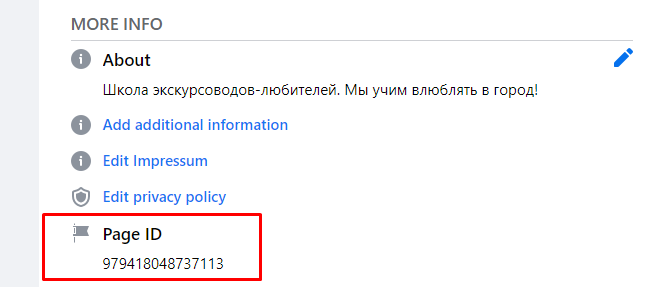

======================
 Facebook Integration
======================

Facebook configuration
======================

Facebook App
------------

* `Create new Facebook App <https://developers.facebook.com/apps>`__

  * **App type:** Business
  * **Apps Purpose:** Yourself or your own business

* In Facebook App page open ``Settings >> Basic`` to get **App ID** (``APP_ID``) and **App Secret** (``APP_SECRET``)

Facebook Page
-------------

* `Select your page <https://www.facebook.com/pages/>`__ or `create new one <https://www.facebook.com/pages/creation>`__
* Get **Page ID** from the Page, that you want to connect to your chat bot.

  * Open to About section of the Page. The url looks like this: ``https://www.facebook.com/YOUR-PAGE-123456789/about/``,
  * Scroll down to the bottom where you will find  **Page ID** value, which is just a big number. Use it as ``PAGE_ID`` value in Project parameters (see below).

Facebook Page: Lead Ad
----------------------

If you plan to use Facebook integration to get leads from Facebook,
`create a lead ad <https://www.facebook.com/business/help/397336587121938>`__ via menu ``Publishing Tools >> Forms Library``.
Once form is created, click `[Create Ad]` button

Facebook Page: Access Token
---------------------------

* Open `Graph API Explorer <https://developers.facebook.com/tools/explorer/>`__
* Select Facebook App you created on the previous step *Facebook App*

  .. image:: facebook-app.png

* Select option "Get User Access Token"
* Select required `permisions <https://developers.facebook.com/docs/pages/overview/permissions-features>`__, e.g.:

  * public_profile
  * pages_show_list
  * pages_read_engagement
  * leads_retrieval
  * pages_manage_metadata

  .. image:: facebook-app-permissions.png
* Press the button `[Generate Access Token]`
* Copy value under *Access Token* label. Use it as ``USER_ACCESS_TOKEN`` value in Project parameters (see below).

You can ignore warning "Submit for Login Review". It just means that you cannot
work with Facebook Pages where you don't have a role.

Installation
============

* Install this module in according to `Sync Studio <https://apps.odoo.com/apps/modules/12.0/sync/>`__ Documentation
* Install python packages:

    python3 -m pip install facebook_business

* Due to `Odoo limitations <https://github.com/odoo/odoo/issues/57133>`__, one of the following workarounds should be applied on setting up webhooks:

    * delete `line <https://github.com/odoo/odoo/blob/db25a9d02c2fd836e05632ef1e27b73cfdd863e3/odoo/http.py#L326>`__ that raise exception in case of type mismatching (search for ``Function declared as capable of handling request of type`` in standard Odoo code). In most cases, this workaround doesn't need to be reverted
    * open file ``sync/controllers/webhook.py`` and temporarily change ``type="json"`` to ``type="http"``

Configuration
=============

* Open menu ``[[ Sync Studio ]] >> Sync Projects``
* Choose ``Facebook`` project
* Go to ``Parameters`` tab
* Click ``[Edit]``
* Fill **Parameters** and **Secrets** with the values you got in previous steps:

  * ``APP_ID``
  * ``APP_SECRET``
  * ``PAGE_ID``
  * ``USER_ACCESS_TOKEN``

* Click ``[Run Now]`` button in ``GENERATE_PAGE_ACCESS_TOKEN``
* Click ``[Run Now]`` button in ``SETUP_APP``
* Click ``[Run Now]`` button in ``SETUP_PAGE_WEBHOOK``

Usage
=====

Lead Ads
--------

Create a lead in facebook and check that it's synced to Odoo
