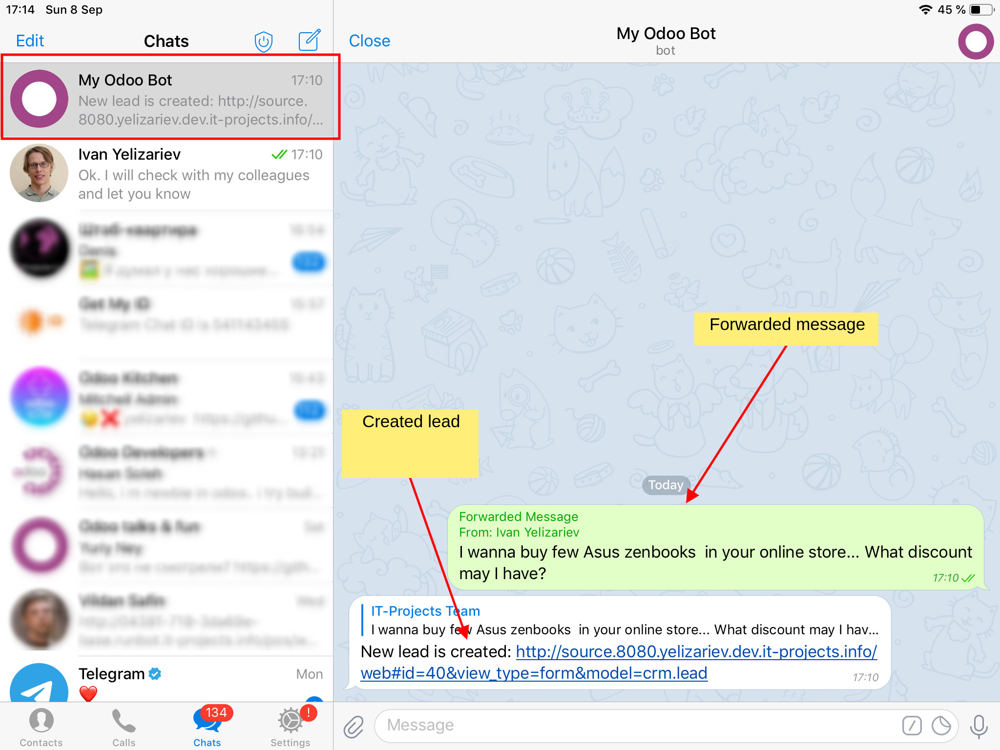

================
 Telegram Leads
================

.. contents::
   :local:

Module Installation
===================
* `Install <https://odoo-development.readthedocs.io/en/latest/odoo/usage/install-module.html>`__ this module in a usual way

OpenAPI
=======

* In Odoo nagivate to menu ``[[ OpenAPI ]] >> Integrations``
* Select integration ``telegram``.
* At **Specification Link** field there is an OpenAPI URL which is needed in next steps
* At ``Allowed Users`` tab click on the admin. You will see **OpenAPI token** which is needed in next steps.

  * You can also set another user to call api methods on behalf of that user

Telegram Bot
============

* In telegram client open `BotFather <https://t.me/botfather>`__
* Send /newbot command to create a new bot
* Follow instruction to set bot name and get bot token
* Keep your token secure and store safely, it can be used by anyone to control your bot

AWS Lambda
==========

* Navigate to https://console.aws.amazon.com/lambda/home
* Click ``Create function``
* Configure the function as described below

Runtime
-------

Use ``Python 3.6``

.. image:: create-lambda.png

Function code
-------------
* Set Code entry type to ``Upload a .zip file``
* Select aws-lambda.zip from ``aws-lambda/`` folder of this module

Environment variables
---------------------

* ``BOT_TOKEN`` -- the one you got from BotFather
* ``LOGGING_LEVEL`` -- Level of loger. Allowed values: DEBUG, INFO, CRITICAL, ERROR, WARNING.  Default value: INFO
* ``ODOO_OPENAPI_SPECIFICATION_URL`` -- **Specification link**
* ``ODOO_OPENAPI_TOKEN`` -- **OpenAPI Token**
* ``TELEGRAM_USERS`` -- comma separated list of telegram users ID. You can get one by sending any message to `Get My ID bot <https://telegram.me/itpp_myid_bot>`__

Trigger
-------

* Use *API Gateway** option
* Set the security mechanism for your API endpoint as Open
* Once you configure it and save, you will see ``Invoke URL`` under Api Gateway details section

Register telegram webhook
=========================

Tell telegram to send notifications to lambda function when bot receives new messages

::

    # set your values
    BOT_TOKEN="PASTE_BOT_TOKEN_HERE"
    INVOKE_URL="https://PASTE-YOUR-INVOKE-URL"

    # execute command below without changes
    curl -XPOST https://api.telegram.org/bot${BOT_TOKEN}/setWebhook --data-urlencode "url=${INVOKE_URL}"

Usage
=====

* In telegram: forward some  messages to the bot
* RESULT: messages are attached to new or existing leads

Support
=======

If something goes wrong feel free to Contact us at sync@it-projects.info.

We may need Odoo logs and `CloudWatch logs <https://aws.amazon.com/cloudwatch/>`__ information as well as proof of purchase.
